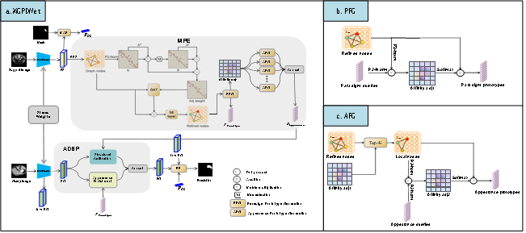

# MGPD-Net: A Multi-Granularity Prototypical Debiasing Network for Few-Shot Medical Image Segmentation

The Implementation of Paper: [MGPD-Net: A Multi-Granularity Prototypical Debiasing Network for Few-Shot Medical Image Segmentation]()



#### Abstract

Abstract The core challenge in Few-Shot Medical Image Segmentation (FSMIS) is representation entanglement, where stable class commonalities (e.g., anatomical structures) and variable sample individualities (e.g., textures) are conflated into a single feature, inherently introducing sampling bias and limiting generalization to unseen samples. While prior works attempt to mitigate this via complex feature interactions, they lack mechanisms to actively decouple these distinct semantics at their origin. To address this, we propose the Multi-Granularity Prototypical Debiasing Network (MGPD-Net), which: (1) explicitly decouples features into semantically orthogonal Paradigm Prototypes (for commonalities) and Appearance Prototypes (for individualities) via a learnable penalty; (2) introduces an Asymmetric Dual Stream Purification (ADSP) module, utilizing Paradigm Prototypes to calibrate global morphology via a Structure Calibration Stream, and Appearance Prototypes to enrich local details via an Appearance Enrichment Stream; and (3) transforms FSMIS from passive prototype matching to an active query feature debiasing process. Experiments on SABS CT and CHAOS MRI (1-shot) yield DSC scores of 76.27% and 80.68%, respectively. Achieving state-of-the-art performance without auxiliary modalities or complex architectures (e.g., Mamba models), our method validates the efficiency and robustness of this debiasing paradigm.

# Getting started

### Dependencies

Please install following essential dependencies:

```
dcm2nii
json5==0.8.5
jupyter==1.0.0
nibabel==2.5.1
numpy==1.22.0
opencv-python==4.5.5.62
Pillow>=8.1.1
sacred==0.8.2
scikit-image==0.18.3
SimpleITK==1.2.3
torch==1.10.2
torchvision=0.11.2
tqdm==4.62.3
```

### Data sets and pre-processing

Download:

1. [Combined Healthy Abdominal Organ Segmentation data set](https://chaos.grand-challenge.org/)
2. [Multi-Atlas Abdomen Labeling Challenge](https://www.synapse.org/#!Synapse:syn3193805/wiki/218292)

Pre-processing is performed according to [Ouyang et al.](https://github.com/cheng-01037/Self-supervised-Fewshot-Medical-Image-Segmentation/tree/2f2a22b74890cb9ad5e56ac234ea02b9f1c7a535) and we follow the procedure on their github repository.

### Training

1. Compile `./supervoxels/felzenszwalb_3d_cy.pyx` with cython (`python ./supervoxels/setup.py build_ext --inplace`) and run `./supervoxels/generate_supervoxels.py`
2. Download pre-trained ResNet-101 weights [vanilla version](https://download.pytorch.org/models/resnet101-63fe2227.pth) or [deeplabv3 version](https://download.pytorch.org/models/deeplabv3_resnet101_coco-586e9e4e.pth) and put your checkpoints folder, then replace the absolute path in the code `./models/encoder.py`.
3. Run `./script/train.sh`

### Inference

Run `./script/test.sh`

### Acknowledgement

Our implementation is based on the works: [SSL-ALPNet](https://github.com/cheng-01037/Self-supervised-Fewshot-Medical-Image-Segmentation), [ADNet](https://github.com/sha168/ADNet), [QNet](https://github.com/ZJLAB-AMMI/Q-Net), [PAMI]([GitHub - YazhouZhu19/Partition-A-Medical-Image: [IEEE TIM 2024] Partition A Medical Image: Extracting Multiple Representative Sub-Regions for Few-shot Medical Image Segmentation](https://github.com/YazhouZhu19/Partition-A-Medical-Image))


